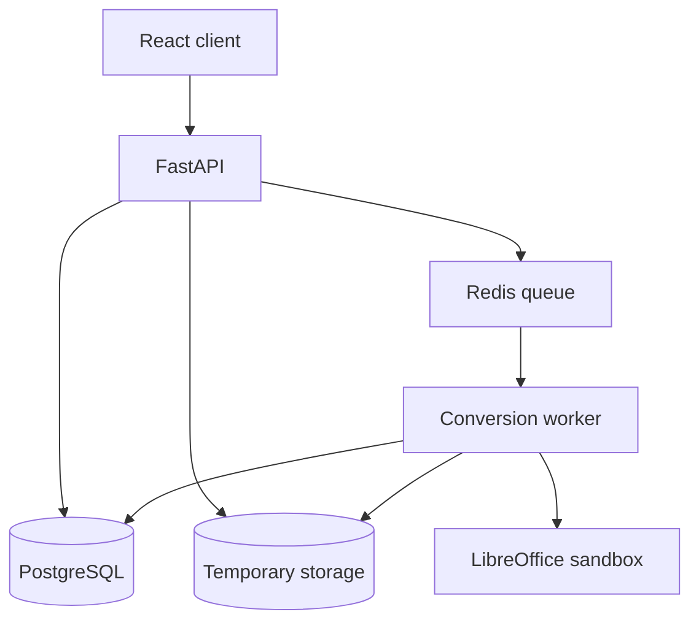

# PDF to DOCX Platform — MVP Development Specification

## 1. Obiettivo

Sviluppare una piattaforma web che converta curriculum PDF nativi in documenti Word `.docx` realmente modificabili, mantenendo con buona fedeltà:

- layout a una o due colonne;
- sidebar laterale;
- testo, font, dimensioni, colori e stili;
- immagini e fotografia;
- margini e dimensioni della pagina.

L'MVP è specializzato nei CV e non deve tentare di supportare qualsiasi tipologia di PDF.

## 2. Vincoli dell'MVP

- PDF nativi, non scansionati;
- massimo 10 MB e 5 pagine;
- layout a una o due colonne;
- nessuna registrazione utente;
- un file per conversione;
- conservazione temporanea massima: 60 minuti;
- output: DOCX modificabile e scaricabile;
- compatibilità da verificare con Microsoft Word e LibreOffice Writer.

Non implementare nell'MVP:

- OCR;
- pagamenti o abbonamenti;
- archivio permanente;
- modifica online del documento;
- conversioni batch;
- modelli AI o LLM;
- supporto generico a riviste, moduli, CAD o PDF complessi.

## 3. Principi tecnici

1. La fedeltà deve essere misurabile, non dichiarata come perfetta.
2. Il DOCX deve contenere testo e strutture Word modificabili, non pagine trasformate in immagini.
3. Per i CV a due colonne usare preferibilmente tabelle Word senza bordi.
4. Usare caselle di testo e posizionamento assoluto solo quando indispensabile.
5. Parsing PDF, analisi layout e generazione DOCX devono essere moduli separati.
6. Prima di generare il DOCX creare un modello intermedio serializzabile in JSON.
7. Non registrare nei log il testo estratto dai documenti.

## 4. Stack stabilito

### Backend

- Python 3.12+
- FastAPI
- Pydantic
- SQLAlchemy + Alembic
- PostgreSQL
- Redis + RQ

### Conversione

- `pdfplumber` per testo, coordinate e oggetti PDF;
- `pypdfium2` per rendering delle pagine;
- `python-docx` per il DOCX;
- `lxml` per funzionalità OOXML non esposte da `python-docx`;
- Pillow/OpenCV per immagini e confronto visivo;
- LibreOffice headless per renderizzare il DOCX prodotto.

### Frontend

- React
- TypeScript
- Vite
- CSS Modules oppure Tailwind CSS, scegliendone uno soltanto.

### Infrastruttura

- Docker e Docker Compose;
- storage S3 compatibile in produzione;
- MinIO o filesystem temporaneo in locale;
- pytest, Ruff e mypy;
- GitHub Actions per CI.

Non introdurre PyMuPDF senza una decisione esplicita sulla licenza AGPL/commerciale. Non usare `pdf2docx` come motore principale.

## 5. Architettura



### Flusso

1. Il client carica il PDF.
2. L'API valida il file e crea un job.
3. Il file viene salvato con un nome interno casuale.
4. Il worker estrae gli elementi e crea il `DocumentModel`.
5. Il layout analyzer identifica colonne, sidebar e blocchi.
6. Il DOCX builder genera il documento modificabile.
7. LibreOffice renderizza il DOCX.
8. Il quality engine confronta originale e risultato.
9. L'utente visualizza stato, warning, anteprima e download.
10. Il cleanup elimina tutto dopo la scadenza.

## 6. Struttura del repository

```text
pdf-to-docx-platform/
├── backend/
│   ├── app/
│   │   ├── api/routes/
│   │   ├── core/
│   │   ├── db/
│   │   ├── domain/
│   │   ├── services/
│   │   ├── conversion/
│   │   │   ├── classifier.py
│   │   │   ├── extractor.py
│   │   │   ├── layout_analyzer.py
│   │   │   ├── models.py
│   │   │   ├── docx_builder.py
│   │   │   └── font_mapper.py
│   │   ├── quality/
│   │   │   ├── renderer.py
│   │   │   └── comparator.py
│   │   ├── workers/
│   │   └── main.py
│   ├── tests/
│   ├── alembic/
│   └── pyproject.toml
├── frontend/
│   ├── src/
│   │   ├── api/
│   │   ├── components/
│   │   ├── pages/
│   │   └── types/
│   └── package.json
├── test-documents/
├── docker-compose.yml
├── .env.example
└── README.md
```

## 7. Modello intermedio

Implementare con Pydantic almeno questi modelli:

```python
from typing import Literal

from pydantic import BaseModel, Field


class BoundingBox(BaseModel):
    x0: float
    y0: float
    x1: float
    y1: float


class TextStyle(BaseModel):
    font_family: str | None
    font_size: float
    color: str
    bold: bool = False
    italic: bool = False
    underline: bool = False


class TextBlock(BaseModel):
    id: str
    bbox: BoundingBox
    text: str
    style: TextStyle
    block_type: Literal["heading", "paragraph", "list_item"]


class Region(BaseModel):
    type: Literal["header", "footer", "sidebar", "main", "column"]
    bbox: BoundingBox
    blocks: list[TextBlock]


class PageModel(BaseModel):
    page_number: int
    width_pt: float
    height_pt: float
    regions: list[Region]


class DocumentModel(BaseModel):
    source_type: Literal["native", "scanned", "hybrid"]
    pages: list[PageModel]
    warnings: list[str] = Field(default_factory=list)
```

Estendere i modelli con immagini e decorazioni durante la seconda milestone, senza legare il dominio agli oggetti di `pdfplumber` o `python-docx`.

## 8. API minima

### `POST /api/v1/conversions`

- input multipart: `file`, `mode=editable|high_fidelity`;
- valida magic bytes, MIME, dimensione e pagine;
- risposta `202` con `job_id`, `access_token`, `status` ed `expires_at`.

### `GET /api/v1/conversions/{job_id}`

- richiede token temporaneo;
- restituisce `status`, `phase`, `progress`, `warnings` ed eventuale errore.

### `GET /api/v1/conversions/{job_id}/result`

- restituisce metriche, URL delle anteprime e disponibilità del download.

### `GET /api/v1/conversions/{job_id}/download`

- restituisce il DOCX solo se il job è completato e non scaduto.

### `DELETE /api/v1/conversions/{job_id}`

- elimina record, PDF, DOCX e anteprime associati.

## 9. Stati del job

```text
QUEUED
PROCESSING:VALIDATING
PROCESSING:EXTRACTING
PROCESSING:ANALYZING_LAYOUT
PROCESSING:BUILDING_DOCX
PROCESSING:RENDERING
PROCESSING:COMPARING
COMPLETED
FAILED
CANCELLED
EXPIRED
```

Ogni transizione deve essere validata dal dominio. Il token di accesso deve essere casuale e memorizzato soltanto come hash.

## 10. Strategia DOCX per i CV

### CV a colonna singola

- una sezione Word con dimensioni e margini equivalenti al PDF;
- paragrafi reali con stili riutilizzabili;
- spacing e interlinea derivati dalle coordinate;
- immagini inline o ancorate quando necessario.

### CV con sidebar

- tabella principale senza bordi con una riga e due colonne;
- larghezze calcolate dalle regioni del PDF;
- shading della cella laterale per lo sfondo;
- paragrafi reali dentro entrambe le celle;
- fotografia e icone inserite come immagini;
- evitare spazi, tabulazioni ripetute e una casella di testo per ogni riga.

### Font

- normalizzare il nome del font estratto;
- usare il font originale solo se disponibile;
- mantenere una mappa di sostituzioni metricamente compatibili;
- aggiungere un warning per ogni sostituzione;
- non incorporare font senza averne verificato la licenza.

## 11. Sicurezza minima

- ID e nomi interni non prevedibili;
- nessun percorso fornito dall'utente;
- limiti di CPU, memoria e durata del worker;
- esecuzione di LibreOffice in container senza privilegi;
- rete disabilitata nei processi di conversione;
- eliminazione di macro, oggetti incorporati e collegamenti esterni dal DOCX;
- rate limiting sugli upload;
- niente testo estratto nei log;
- cleanup periodico e idempotente.

## 12. Piano di implementazione

### Milestone 1 — Infrastruttura e job

**Stato: completata e verificata il 31 luglio 2026.**

- creare repository e Docker Compose;
- configurare FastAPI, PostgreSQL, Redis e worker;
- implementare `ConversionJob`, migrazione e repository;
- implementare upload sicuro, polling, download ed eliminazione;
- aggiungere test API e CI.

**Completata quando:** un PDF valido viene caricato, elaborato da un task fittizio e restituito come artefatto scaricabile; scadenza e cancellazione funzionano.

### Milestone 2 — Parsing e modello intermedio

**Stato: completata e verificata il 31 luglio 2026.**

- classificare PDF nativo/scansionato/ibrido;
- estrarre pagine, testo, coordinate e stili;
- costruire `DocumentModel` JSON;
- rilevare ordine di lettura, colonne e sidebar;
- creare fixture per CV anonimi.

**Completata quando:** almeno 10 CV di test producono un modello coerente e verificabile senza generare ancora il DOCX finale.

### Milestone 3 — Generazione DOCX

**Stato: completata e verificata il 2 agosto 2026.**

- generare pagina, margini, paragrafi e stili;
- implementare CV a colonna singola;
- implementare layout sidebar con tabella senza bordi;
- aggiungere immagini, colori e font mapping;
- produrre warning per elementi non supportati.

**Completata quando:** i DOCX sono modificabili e si aprono senza errore in Word e LibreOffice; testo e struttura principale corrispondono alle fixture.

### Milestone 4 — Qualità e interfaccia

**Stato: completata e verificata il 2 agosto 2026.**

- renderizzare originale e DOCX;
- calcolare similarità visiva e differenze principali;
- mostrare upload, avanzamento, anteprime, warning e download;
- aggiungere test end-to-end.

**Completata quando:** l'utente completa l'intero flusso e riceve un punteggio di qualità interpretabile.

### Milestone 4.1 — Miglioramento layout Canva

**Stato: completata e verificata il 2 agosto 2026.**

- rilevare fasce hero e schede locali senza trasformarle in colonne globali;
- riprodurre sfondi principali, fotografia, card e linee d'accento con strutture Word modificabili;
- distinguere realmente le modalità `editable` e `high_fidelity`;
- usare sostituzioni metricamente compatibili per Open Sans ed EB Garamond;
- aggregare i warning decorativi per pagina;
- aggiungere fixture sintetiche e regressione visuale su un CV Canva privato di quattro pagine.

**Completata quando:** entrambe le modalità mantengono il numero di pagine, il testo resta
modificabile con accuratezza almeno del 99% e nessun testo della fascia hero risulta invisibile.

### Milestone 4.2 — Fedeltà geometrica dei layout complessi

**Stato: completata e verificata il 3 agosto 2026.**

- rilevare colonne locali sotto una fascia hero, senza applicare la suddivisione all'intera pagina;
- ancorare a coordinate pagina sfondi full-bleed, fotografie e card sovrapposte;
- preservare separatori verticali, punti elenco e spaziatura ricavata dai bounding box sorgente;
- impedire che una card sovrapposta generi pagine aggiuntive in Word o LibreOffice;
- aggiungere una regressione automatica sul fixture Canva pubblico e verificare il CV privato di
  quattro pagine tramite rendering.

**Completata quando:** il fixture pubblico conserva testo, header, fotografia e due colonne nella
pagina originale, con punteggio almeno 85; il CV Canva privato conserva quattro pagine, accuratezza
testuale del 100% e punteggio almeno 80.

### Milestone 5 — Hardening MVP

- sandbox e limiti risorse;
- rate limiting e cleanup automatico;
- metriche, error tracking e log strutturati;
- test di carico e verifica sicurezza;
- deployment di staging.

**Completata quando:** tutti i criteri di accettazione risultano superati nell'ambiente di staging.

## 13. Test obbligatori

### Unit test

- validazione upload;
- transizioni di stato;
- classificazione PDF;
- raggruppamento in righe e blocchi;
- rilevamento colonne;
- mapping degli stili;
- calcolo delle metriche.

### Integration test

- upload → queue → worker → storage;
- PDF → `DocumentModel`;
- `DocumentModel` → DOCX;
- DOCX → rendering → quality report;
- scadenza ed eliminazione.

### Dataset iniziale

- 5 CV a colonna singola;
- 10 CV con sidebar;
- 5 CV a due colonne;
- 5 PDF non supportati o malformati.

Usare soltanto documenti sintetici o anonimizzati.

## 14. Criteri di accettazione

- almeno il 90% dei CV nativi del dataset viene convertito senza errori;
- accuratezza del testo almeno del 99% sui PDF nativi supportati;
- sidebar e colonne mantengono ordine e posizione relativa;
- immagini principali presenti e proporzionate;
- DOCX valido e modificabile in Word e LibreOffice;
- conversione di un CV di 2 pagine entro 30 secondi al 95° percentile nell'ambiente di riferimento;
- nessun contenuto documentale nei log;
- file eliminati automaticamente entro il TTL;
- errori pubblici privi di stack trace e percorsi interni.

## 15. Regole per Copilot

Quando si usa questo file come contesto di sviluppo:

1. implementare una milestone alla volta;
2. non aggiungere funzionalità escluse dall'MVP;
3. non cambiare stack o architettura senza motivazione esplicita;
4. proporre prima interfacce e test, poi l'implementazione;
5. mantenere separati dominio, infrastruttura e librerie di conversione;
6. non usare direttamente tipi di librerie esterne nel `DocumentModel`;
7. non dichiarare completata una milestone senza eseguire i test;
8. aggiornare README, migrazioni e `.env.example` quando necessario;
9. non inserire segreti, token o documenti personali nel repository;
10. in caso di ambiguità, scegliere la soluzione più semplice compatibile con i criteri di accettazione.

## 16. Primo task da eseguire

Avviare esclusivamente la **Milestone 1**:

1. creare la struttura del repository;
2. aggiungere Docker Compose con API, PostgreSQL e Redis;
3. configurare progetto Python, lint, type checking e pytest;
4. implementare entità e tabella `ConversionJob`;
5. implementare `POST /conversions` e `GET /conversions/{job_id}` con worker fittizio;
6. aggiungere test unitari e di integrazione;
7. documentare avvio locale e variabili d'ambiente.

Non iniziare il motore PDF finché questa milestone non supera i test.
